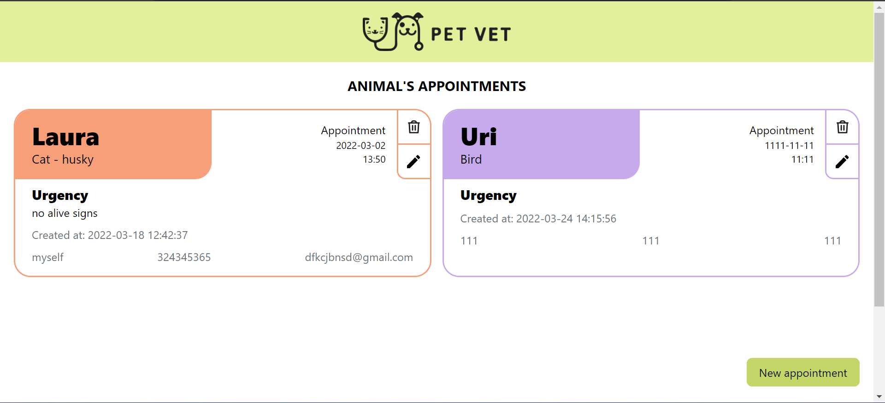
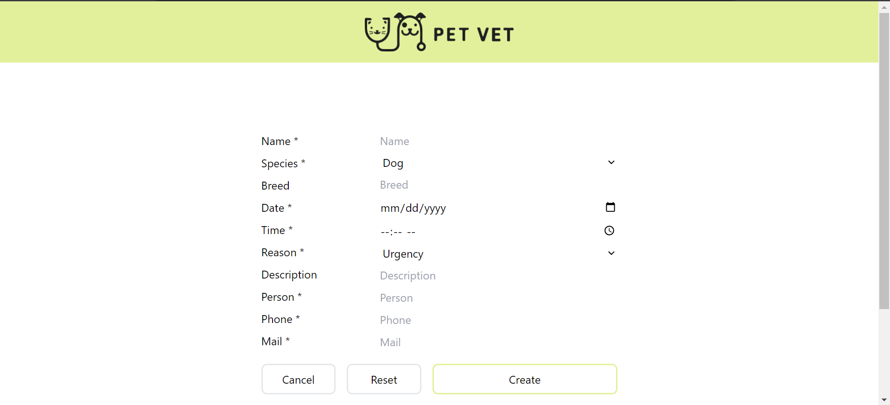
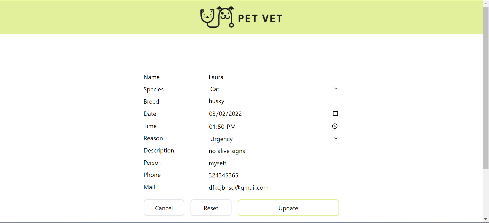
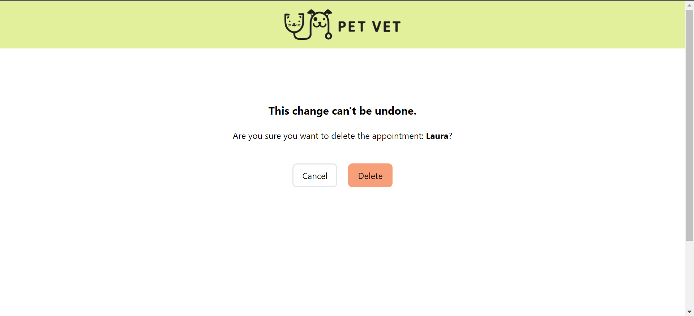
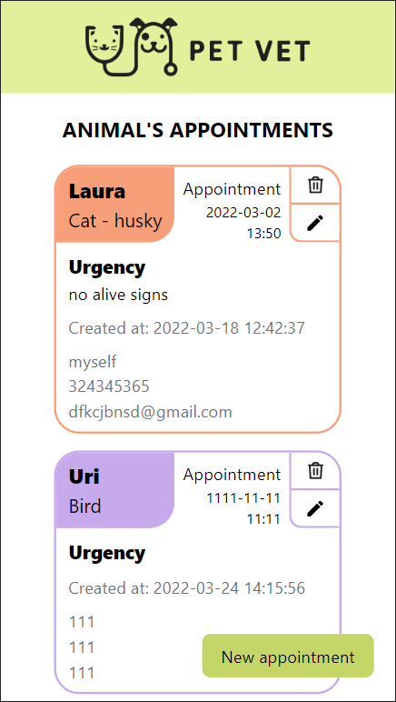

# PHP CRUD MVC

## About the project
This project is part of a formation course by FactoriaF5 where de main goal is to adquire the ability to create a fully functional database which can be accessed by the MVC (Model View Controller) method using PHP and give the user the ability to do the CRUD (Create, Read, Update and Delete).
The project was done in group of 5 people using the SCRUM method.

## The app
Pup vet is an easy and agile way to organise appointments. It's ment to be an internal aplication for a veterinary so the person who takes the apointments can add, delete, modify and see the apointmens in a clean user friendly interface.








## The repo structure
This repo contains several documents and folders. We've separated de MVC documents in diferent folders, wich are: Models, View, Controllers, Core all of them inserted in the \src folder with the database.php and the index.php documents.
Outside \src there are the index.php and Composer.json documents.

## How to use
This is a public repo so anyone who wants to usit feel free to clone it.
`git clone https://github.com/MADROCHA/veterinary_crud_php.git`
If you want to use this repo you should have the last version of [composer](https://getcomposer.org/ "composer") and install it using composer install in the VScode terminal for example. 
This will add the vendor folder to the project which is needed for it to work. 
The next step will be creating the database so you should open a server administrator and create the database with the name "veterinary" in phpMyAdmin then copy the following SQL code in veterinary database to create the table:
```
    SET SQL_MODE = "NO_AUTO_VALUE_ON_ZERO";
    SET AUTOCOMMIT = 0;
    START TRANSACTION;
    SET time_zone = "+00:00";
    
    DROP TABLE IF EXISTS `appointmentsvet`;
    CREATE TABLE IF NOT EXISTS `appointmentsvet` (
      `id` int(11) NOT NULL AUTO_INCREMENT,
      `name` varchar(255) NOT NULL,
      `species` varchar(255) NOT NULL,
      `breed` varchar(255) NOT NULL,
      `date` date NOT NULL,
      `time` time NOT NULL,
      `reason` varchar(255) NOT NULL,
      `description` varchar(255) NOT NULL,
      `person` varchar(255) NOT NULL,
      `phone` int(11) NOT NULL,
      `mail` varchar(255) NOT NULL,
      `created_at` timestamp NOT NULL DEFAULT CURRENT_TIMESTAMP,
      `updated_at` timestamp NOT NULL DEFAULT CURRENT_TIMESTAMP,
      PRIMARY KEY (`id`)
    ) ENGINE=InnoDB AUTO_INCREMENT=2 DEFAULT CHARSET=utf8;
    
    INSERT INTO `appointmentsvet` (`id`, `name`, `species`, `breed`, `date`, `time`, `reason`, `description`, `person`, `phone`, `mail`, `created_at`, `updated_at`) VALUES
    (1, 'Muxi', 'dog', '', '2022-03-23', '13:40:00', 'urgence', 'Lorem Ipsum', 'Ricard Persona Prueba', 656543422, 'ricardpp@gmail.com', '2022-03-18 11:52:21', '2022-03-18 11:52:21');
    COMMIT;
```

Now you're all set, the last thing would be accesing your localhost by writing the next command in your terminal `php -S localhost:"choose a port"` then just follow the link from the terminal.
Keep in mind that you should choose a port for your localhost to work for example `php -S localhost:8000`.

## Future versions
For next versions our team wants to add a filter for the appointments so the user will be able to filter the appointment cards depending on the date they were made or the date of the appointment.
We also plan to add som testing to the code as well as a navbar that will allow the user to search for an appointment.

## Tools that made possible this project
- PHP
- HTML
- Tailwind CSS
- GitHub
- MySQL
- phpMyAdmin
- XAMPP
- Composer
- Trello
- Figma
- VScode

## Authors
- [Jessica Mejia](https://github.com/itsberriver "Jessica Mejia GitHub profile")
- [Ales](https://github.com/aleswebgit "Ales GitHub profile") 
- [Albert Martínez](https://github.com/QuercusJS "Albert Martínez GitHub profile")
- [Miguel Ángel Domingez](https://github.com/MADROCHA "Miguel Ángel Domingez GitHub profile")
- [Uri C. V.](https://github.com/UriCV "Uri C. V. GitHub profile")

## Acknowledgments
Thanks to FactoriaF5 🧡 for training future coders!